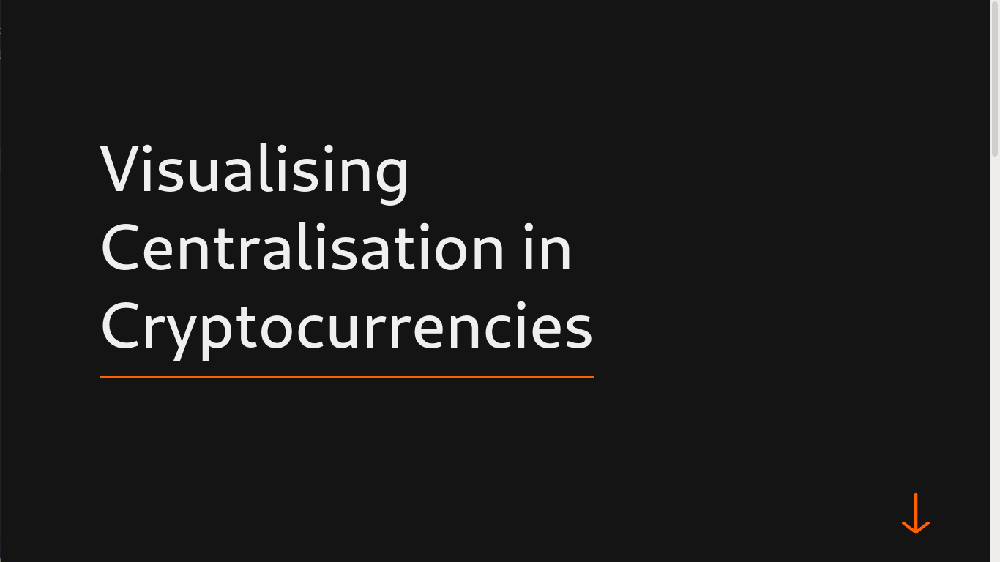
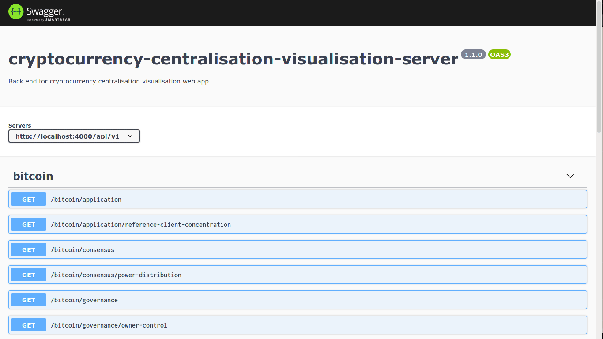

# cryptocurrency-centralisation-visualisation



This project aims to design a consolidated GUI dashboard to visualize the current state of centralization in significant cryptocurrencies.

## Getting started

### API Documentation



The documentation for the API created to fetch the data for the graphs can be found in the `/api-docs` route

### Running the website using Docker

#### Prerequisites

You will need to have installed:

1. Docker

#### Running the website for production using Docker Hub

The built images for this project can be found on [Docker Hub](https://hub.docker.com/u/swenggroup20).

1. Create a `docker-compose.yml` file. An example one is found below

   ```yaml
   version: "3.9"
   services:
   client:
     image: swenggroup20/cryptocurrency-centralisation-visualisation-client:latest
     container_name: cryptocurrency-centralisation-visualisation-client
     restart: always
     ports:
       - "3000:3000"
     environment:
       - NODE_ENV=production
     networks:
       - network
     stdin_open: true
     tty: true

   server:
     image: swenggroup20/cryptocurrency-centralisation-visualisation-server:latest
     container_name: cryptocurrency-centralisation-visualisation-server
     restart: always
     ports:
       - "4000:4000"
     environment:
       - NODE_ENV=production
       - CORS_ORIGIN_URL=${CORS_ORIGIN_URL}
       - POSTGRES_PASSWORD=${POSTGRES_PASSWORD}
       - GITHUB_TOKEN=${GITHUB_TOKEN}
     networks:
       - network
     depends_on:
       - db

   db:
     image: swenggroup20/cryptocurrency-centralisation-visualisation-database:latest
     container_name: cryptocurrency-centralisation-visualisation-database
     restart: always
     environment:
       POSTGRES_PASSWORD: ${POSTGRES_PASSWORD}
     networks:
       - network
     volumes:
       - database_data:/var/lib/postgresql/data

   networks:
   network:
     name: cryptocurrency-centralisation-visualisation-network
     driver: bridge

   volumes:
   database_data:
     name: cryptocurrency-centralisation-visualisation-database-data
   ```

2. Create a `.env` file in the same directory. An example one is found below
   ```dosini
   # URL of the host website
   CORS_ORIGIN_URL=https://example.com:3000
   # URL of the API
   API_HOST=https://example.com:4000
   # Password for the PostgreSQL database
   POSTGRES_PASSWORD=strong_password
   # GitHub Token, can be created by following https://docs.github.com/en/github/authenticating-to-github/creating-a-personal-access-token
   GITHUB_TOKEN=d645b99a197d32a71de199e329f9c986b9427348
   ```
3. Run `docker-compose up` command
   ```
   docker-compose up
   ```

You can then add TLS/SSL using a reverse proxy. You can use any reverse proxy software you like e.g. NGINX

#### Running the website for development

1. Clone the repo
   ```
   git clone https://github.com/sweng-group-20/cryptocurrency-centralisation-visualisation.git
   ```
2. Navigate into the cloned GitHub repository
   ```
   cd cryptocurrency-centralisation-visualisation
   ```
3. Copy `.env_example` to `./docker/.env` and change `CORS_ORIGIN_URL`, `API_HOST`, `POSTGRES_PASSWORD` and `GITHUB_TOKEN`
4. Run the start script using `./docker/dev.sh` if on linux or `./docker/dev.ps1` if on windows.

The local website is hosted on [`http://localhost:3000`](http://localhost:3000) and the api will be hosted on [`http://localhost:4000`](http://localhost:4000)

### Running the website without Docker

#### Prerequisites

You will need to have installed:

1. Node.js
2. Yarn

#### Running the website for development

1. Clone the repo
   ```
   git clone https://github.com/sweng-group-20/cryptocurrency-centralisation-visualisation.git
   ```
2. Navigate into the cloned GitHub repository
   ```
   cd cryptocurrency-centralisation-visualisation
   ```
3. Ensure that the environment variables `CORS_ORIGIN_URL` and `API_HOST`. For the purposes of development they can be set to `http://localhost:3000` and `http://localhost:4000` respectively.
4. Navigate into the server directory
   ```
   cd server
   ```
5. Run the `yarn install` script and the `yarn start:dev` script
   ```
   yarn install
   yarn start:dev
   ```
6. In another terminal navigate into the client directory
   ```
   cd client
   ```
7. Run the `yarn install` script and the `yarn start` script
   ```
   yarn install
   yarn start
   ```

The local website is hosted on [`http://localhost:3000`](http://localhost:3000) and the api will be hosted on [`http://localhost:4000`](http://localhost:4000)

| ℹ️  | To setup the application layer graphs, you must have access to an instance a PostgreSQL database |
| :-: | :----------------------------------------------------------------------------------------------- |

## Authors

1. Lexes Jan Mantiquilla ([@lexesjan](https://github.com/lexesjan))
2. Tim Kelly ([@timotheekelly](https://github.com/timotheekelly))
3. Aodhán Keane ([@aodhanocathain](https://github.com/aodhanocathain))
4. Stephen Davis ([@SteDavis20](https://github.com/SteDavis20))
5. Alex Robert Mahon ([@juuiko](https://github.com/juuiko))
6. Leona Wolff ([@leonawolff](https://github.com/leonawolff))
